# 🚧 CivicAssist – Smart Civic Issue Reporting App 📱🏙️

CivicAssist is a modern civic-issue reporting application that empowers citizens to report problems like potholes, broken streetlights, garbage overflow, and water leakage — all through a simple and intuitive Android app built with **Jetpack Compose**.  
The system also includes an **Admin Dashboard** and a robust **Node.js backend** with MongoDB, Cloudinary, and Firebase Authentication.

This project aims to make cities more responsive, transparent, and citizen-friendly. 🚀

---

## 📊 App Flowchart  

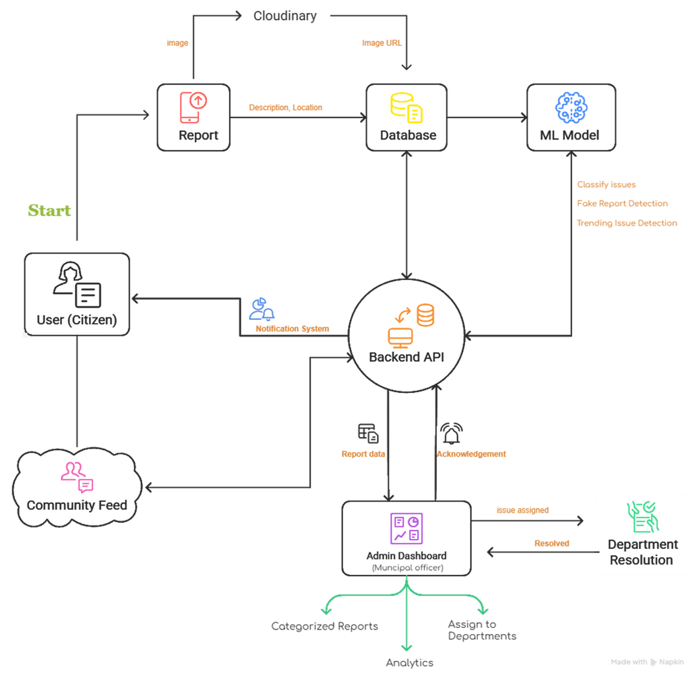

---

# 📱 User App Screenshots

| Phone Number           | OTP Screen             | Community Feed         |
|------------------------|------------------------|------------------------|
|      | 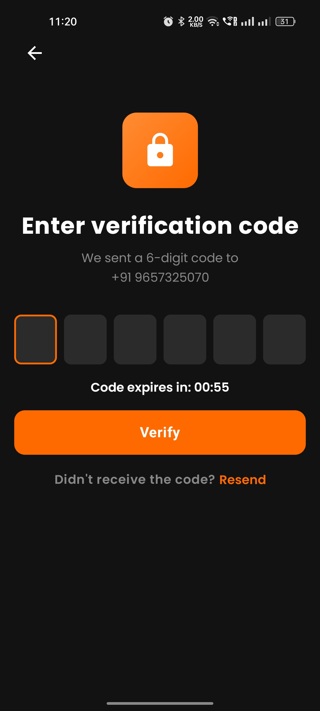   | 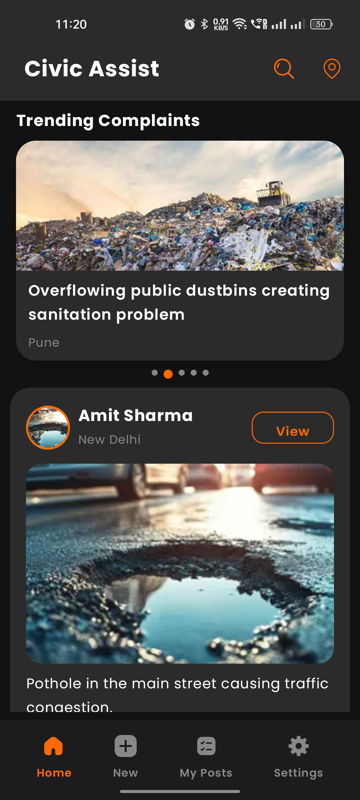     |

| Report Complaint       | Google Map             | Category               |
|------------------------|------------------------|------------------------|
| 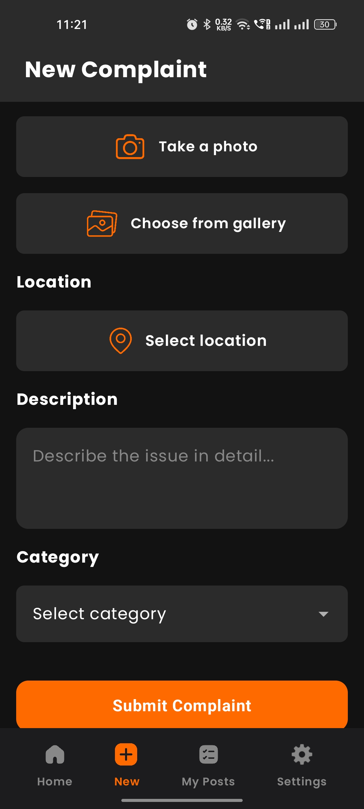  | 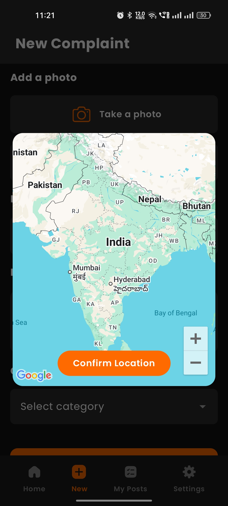     | 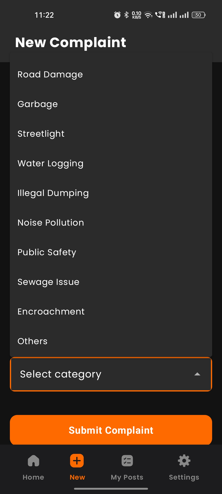    |

| My Complaints          | Complaints Details     | Settings               |
|------------------------|------------------------|------------------------|
| 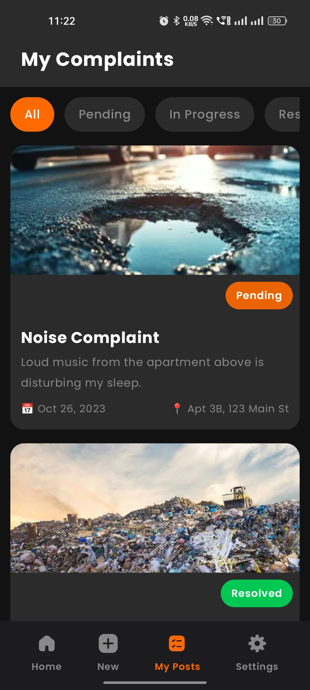  | 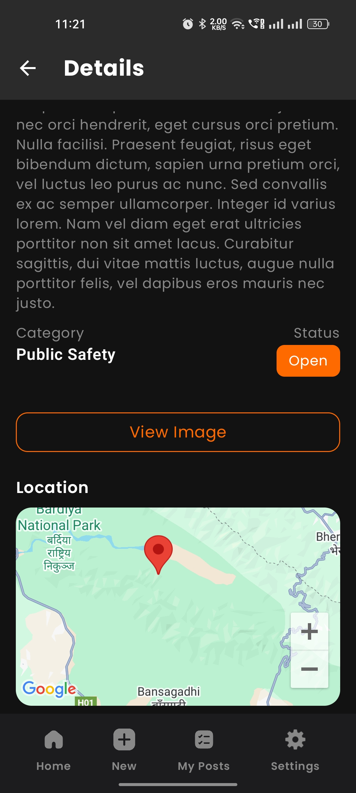     | 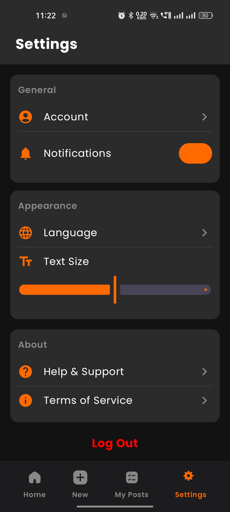    |

---

# 🖥 Admin Dashboard Screenshots

| Admin Login            | Dashboard Overview     | Dashboard Overview     |
|------------------------|------------------------|------------------------|
| 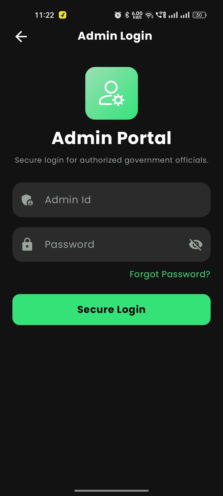    | 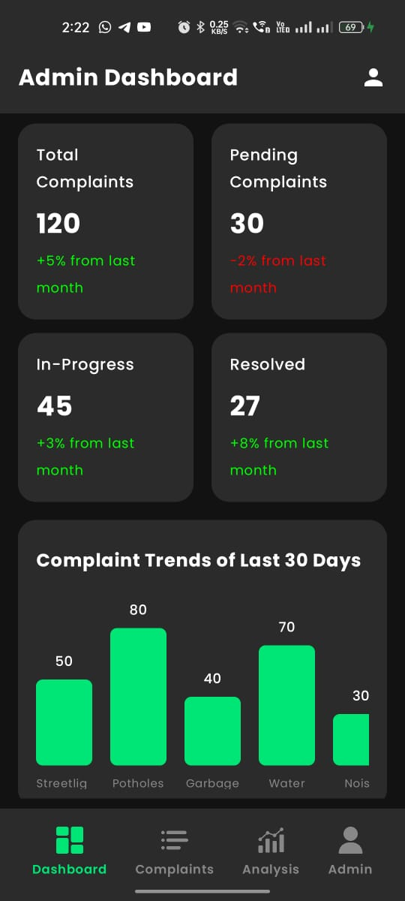    | 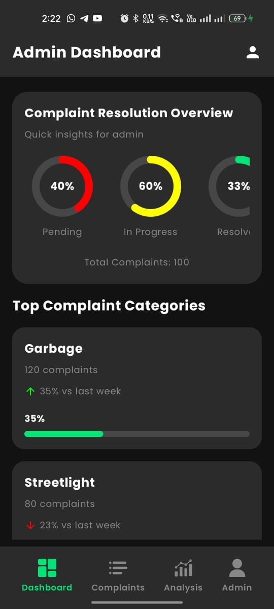 |

| All Complaints         | Complaints Details     | Change Status          |
|------------------------|------------------------|------------------------|
| 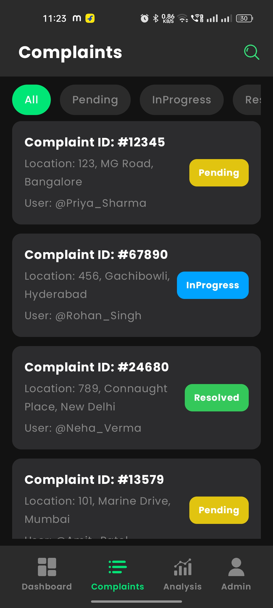    | 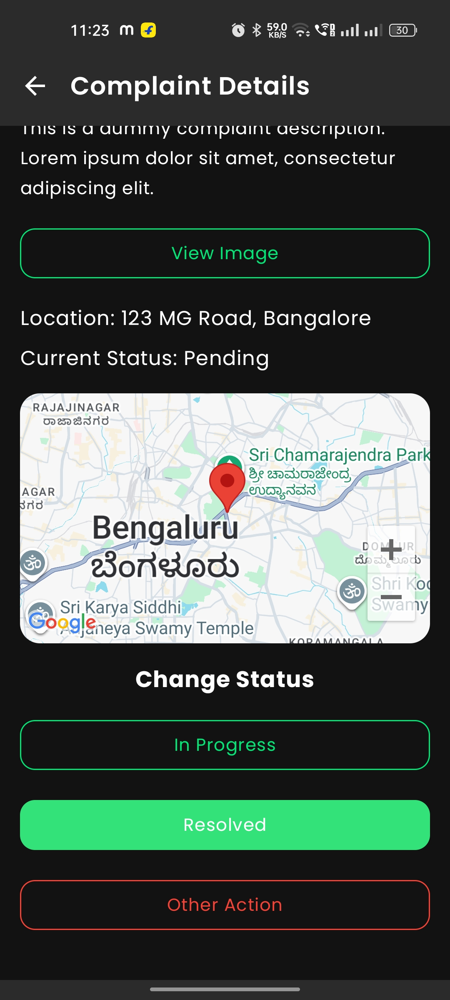    | 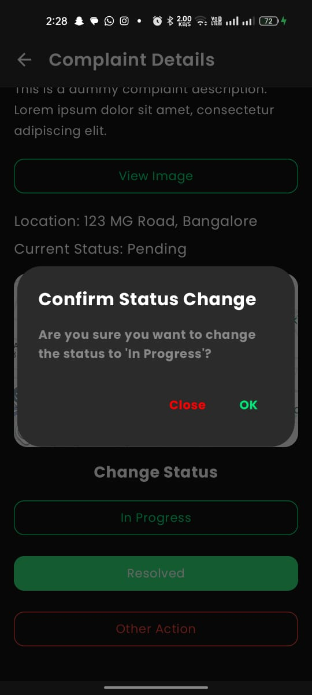 |

---

# 💡 Technologies Used

### 📱 **Android (User App)**
- ⚛️ **Jetpack Compose**
- 📐 **MVVM Architecture**
- 🔗 **Retrofit** (API calls)
- 🧭 **Navigation Compose**
- 🔐 **Firebase Phone OTP Authentication**
- 🌍 **Google Maps Location API**
- 📦 **Coil** (Image loading)

### 🖥 **Backend**
- 🟩 **Node.js + Express.js**
- 🍃 **MongoDB + Mongoose**
- ☁️ **Cloudinary** (Image upload)
- 🔐 **JWT (for Admin Authentication)**
- 📡 **REST APIs**
- 🛠 **Multer** (Temporary media handling)

### 🤖 **Machine Learning (Phase 2)**
- Fake/Spam Report Detection  
- Automatic Issue Categorization (Road, Water, Garbage, Electrical…)  
- Trending Issue Detection using upvotes, frequency & location clusters  

---

# 🚀 How It Works

1. **User logs in** using Firebase Phone OTP (no password needed).
2. **User reports an issue** with:
   - Image  
   - Short description  
   - Auto-detected location  
3. Image uploads to **Cloudinary**, URL is saved in MongoDB.
4. Backend stores the complaint and sends data to admin panel.
5. **Admin Dashboard**:
   - Sees categorized complaints  
   - Assigns issue to appropriate department  
   - Tracks resolution  
6. Citizens can view issues publicly on the **Community Feed**.
7. Trending issues are highlighted using upvotes and frequency.
8. Once resolved, user gets **real-time notification**.

---

# 📚 API Endpoints (Backend)

| Method | Endpoint               | Description                        |
|--------|------------------------|------------------------------------|
| POST   | `/api/auth/login`      | Firebase-based user login          |
| POST   | `/api/report`          | Create a new complaint             |
| GET    | `/api/report`          | Get all complaints                 |
| GET    | `/api/report/:id`      | Get single complaint               |
| POST   | `/api/comment/:id`     | Add comment on complaint           |
| POST   | `/api/report/upvote`   | Upvote a complaint                 |
| POST   | `/api/admin/assign`    | Assign complaint to department     |

*(Add your own endpoints later)*

---

# 🧠 App Architecture

### **User App (Android)**
